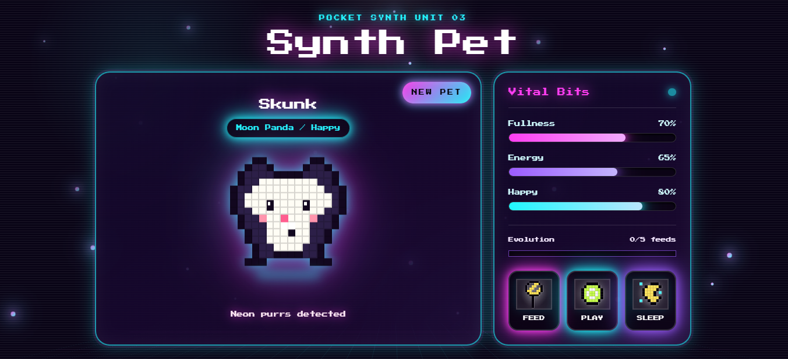
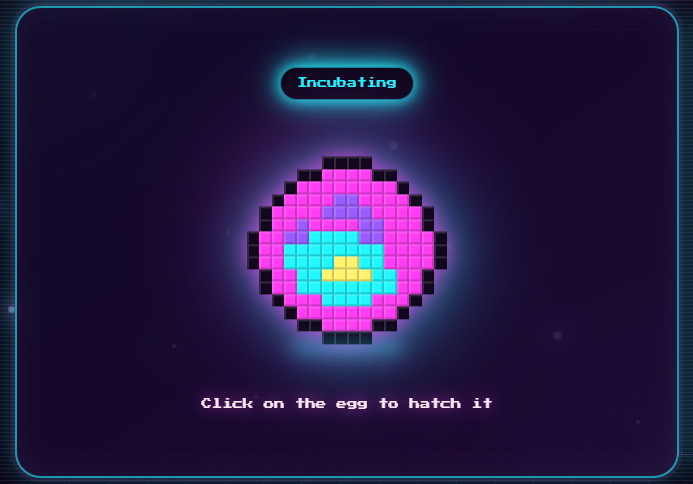
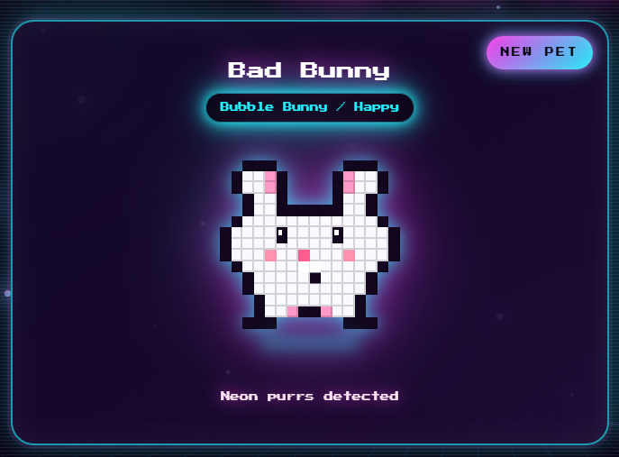
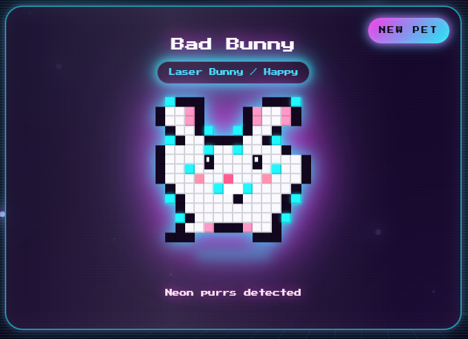

# Synth Pet 👾✨

A retro-inspired digital pet web app built with React, Vite, JavaScript, and Tailwind CSS.

Inspired by early 2000s Tamagotchi devices, neon cyberpunk aesthetics, arcade interfaces, and pixel-art games, Synth Pet lets users care for a glowing digital companion that evolves over time based on player interaction.

The project combines nostalgic visuals with modern frontend development practices to create a fun, interactive browser experience.

---

## 🌌 Features

* 👾 Interactive digital pet
* 🍔 Feed, 🎮 Play, and 😴 Sleep actions
* 📊 Hunger, happiness, and energy stats
* ⏳ Stats gradually decrease over time
* 😊 Dynamic pet moods based on stat levels
* ⚡ Neon cyberpunk-inspired UI
* 🖥️ Pixel-art + CRT aesthetic
* ✨ Evolution system:

  * Pet evolves after being fed 5 times
  * Dramatic evolution animation sequence
  * Evolved pet keeps the same identity while becoming larger and more advanced
* 🌈 Responsive design
* 🎨 Retro glow effects and arcade-inspired styling

---

## 📸 Screenshots

### App



### Egg Form



### Pet


### Evolved Form



---

## 🛠️ Tech Stack

* **React** — UI and component architecture
* **Vite** — Fast development environment
* **JavaScript** — Application logic
* **Tailwind CSS** — Styling and neon effects

---

## 🚀 Getting Started

### Clone the repository

```bash
git clone https://github.com/kithrine/synth-pet.git
```

### Navigate into the project folder

```bash
cd synth-pet
```

### Install dependencies

```bash
npm install
```

### Start the development server

```bash
npm run dev
```

---

## 🧠 How It Works

The pet’s stats change dynamically over time using React state and intervals.

Users must manage:

* Hunger
* Happiness
* Energy

Interactions affect the pet’s mood and overall wellbeing.

After the player feeds the pet 5 times, the pet evolves into a more advanced form through a retro-inspired animated evolution sequence featuring:

* Neon flashes
* Glow effects
* Pixel distortion
* CRT-style transitions

---

## 📂 Project Structure

```txt
src/
│
├── components/
│   ├── Pet.jsx
│   ├── Stats.jsx
│   ├── Controls.jsx
│   ├── EvolutionAnimation.jsx
│
├── App.jsx
├── main.jsx
├── index.css
```

### Main Components

| Component                | Purpose                          |
| ------------------------ | -------------------------------- |
| `Pet.jsx`                | Displays the pet and mood states |
| `Stats.jsx`              | Renders stat bars and values     |
| `Controls.jsx`           | Handles user interaction buttons |
| `EvolutionAnimation.jsx` | Plays the evolution sequence     |

---

## 🎨 Design Inspiration

Synth Pet draws inspiration from:

* Tamagotchi
* Digimon virtual pets
* Early 2000s web design
* CRT monitors
* Retro arcade machines
* Vaporwave & synthwave aesthetics
* Pixel-art games

---

## 🔮 Future Features

Planned improvements and ideas:

* 💾 Save system with localStorage
* 🔊 Retro sound effects
* 🧬 Multiple evolution stages
* 🎒 Inventory/items system
* 🎮 Mini games
* 🌙 Dynamic day/night cycle
* 🧪 Random pet events
* 🏆 XP and leveling system
* 🐾 Additional pet types
* 📱 Mobile optimization improvements

---

## 🧑‍💻 What I Learned

This project helped strengthen skills in:

* React hooks (`useState`, `useEffect`)
* State management
* Timers and intervals
* Conditional rendering
* Component organization
* Tailwind CSS styling
* UI animation and visual effects
* Designing interactive frontend experiences

---

## 💜 Credits

Created as a vibe-coding project inspired by nostalgic digital pets and retro-futuristic aesthetics.

Built with React + Tailwind CSS.

---

## 📜 License

This project is open source and available under the MIT License.
